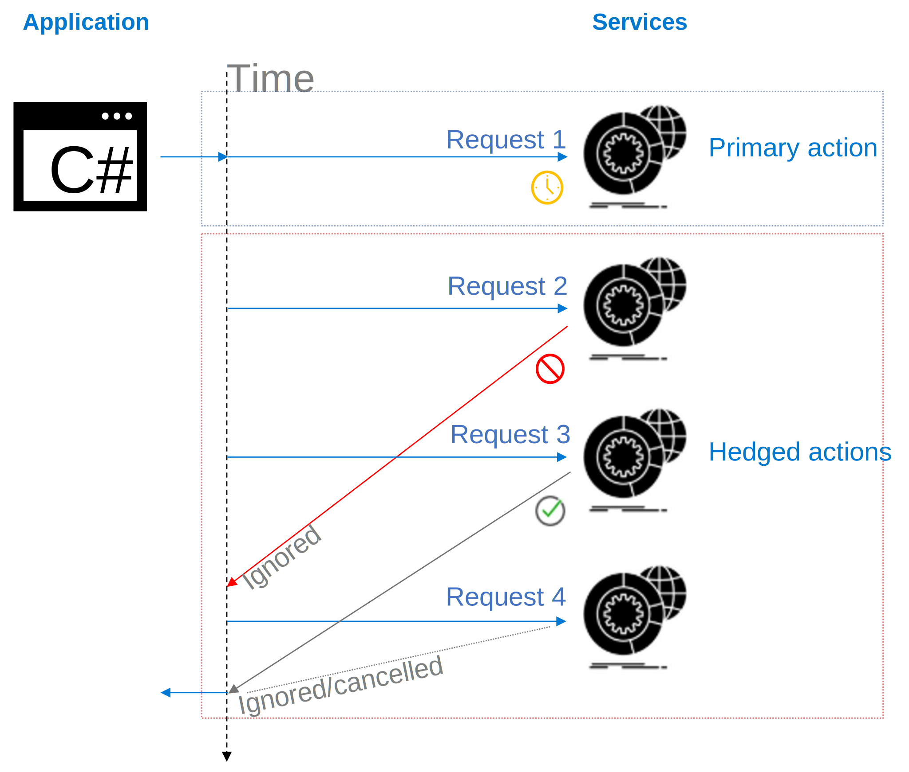

# Polly.Contrib.Hedging

The Polly.Contrib.Hedging exposes a custom policy, i.e. Hedging.
The hedging policy allows the execution of multiple tasks with different degrees of concurrency, until one of them completes with success or until all of them are failed.

## What is Hedging?

The hedging strategy is a latency improvement and resilience support strategy, which assumes sending the same request to multiple replicas and using the result from the first to respond. 

According to [The Tail at Scale](http://cacm.acm.org/magazines/2013/2/160173-the-tail-at-scale/fulltext),
<i>Hedged requests are a strategy to curb this latency variability: issue the same request twice and use the first response. The method employed here issues the second request only after passing a duration threshold supplied as a parameter.</i>.

The idea behing this strategy is that if a server can respond fast enough, we can avoid sending a second request, duplicating work for little gain. Issuing a hedge request for only the slowest (e.g. 5%), ensures the latency reduction is impactful, costing only a 5% increase in duplicated work.

## What does the policy do?

- It defines multiple backup solutions when an operation fails
- Hedging means spawning multiple concurrent execution paths to substitute a possible failure on the primary path
- It allows supporting backup solutions (similar to the [Fallback policy](https://github.com/App-vNext/Polly/wiki/Fallback)) in a concurrent manner (unlike the sequential approach of the [Fallback policy](https://github.com/App-vNext/Polly/wiki/Fallback)).

## Mechanism

- Initiates a primary action and waits a predefined interval
- After the interval has passed it spawns a parallel request as backup
- It waits for the first successful request to complete and return it
- The policy will terminate any other hedged ongoing request and cleanup resources

## When do we need this policy?

- A common case is the use of multiple endpoints of a service for retrieving a resource.
- When there are multiple possible solutions for a task, if high latency is not desired, then hedging is needed. It allows the selection of the fastest solution from a set and it has as primary goal the improvement of latency.

# Usage

The hedging policy is an asynchronous reactive policy. It can be used as a generic policy to handle specific types of results, or as non-typed policy to handle exceptions/faults in general.

## Generic usage
    var provider = new HedgedTaskProvider<HttpResponseMessage>(
        (HedgingTaskArguments args, out Task<HttpResponseMessage>? result) =>
        {
            result = ExecuteAnotherRequestAsync(args);
            return true;
        });

    var hedgingPolicy = Policy
        .Handle<HttpRequestException>()
        .HandleResult<HttpResponseMessage>(r => r.StatusCode == HttpStatusCode.InternalServerError)
        .OrResult(r => r.StatusCode == HttpStatusCode.BadGateway)
        .AsyncHedgingPolicy(
            hedgedTaskProvider: provider,
            maxHedgedTasks: 3,
            hedgingDelayGenerator: attempt => TimeSpan.FromMilliseconds(200),
            onHedgingAsync: (exception, context, attempt, cancellationToken) =>
            {
                // Ideal place for telemetry
            });

## General usage
    var provider = new HedgedTaskProvider(
        (HedgingTaskArguments args, out Task? task) =>
        {
            task = ExecuteAnotherOperationAsync(args);
            return true;
        });

    var hedgingPolicy = Policy
        .Handle<FooException>()
        .Handle<BarException>()
        .AsyncHedgingPolicy(
            hedgedTaskProvider: provider,
            maxHedgedTasks: 3,
            hedgingDelayGenerator: attempt => TimeSpan.FromMilliseconds(200),
            onHedgingAsync: (exception, context, attempt, cancellationToken) =>
            {
                // Ideal place for telemetry
            });

# Further reading

- [Changelog](docs/CHANGELOG.md)
- [Code of conduct](docs/CODE_OF_CONDUCT.md)
- [How to contribute](docs/CONTRIBUTING.md)